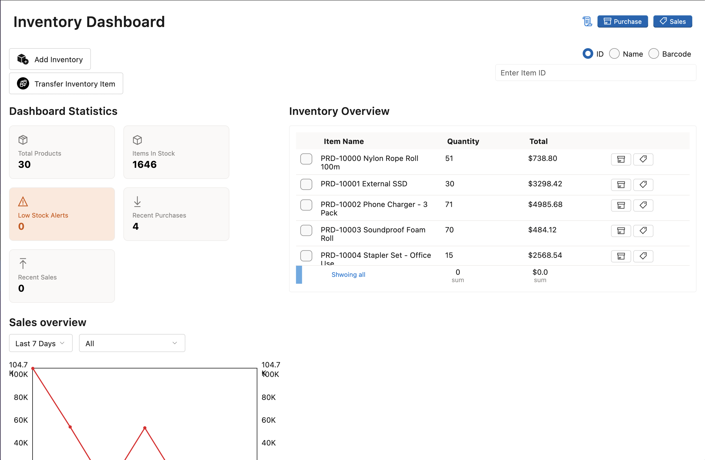

# 🗃️ Inventory Management Software

A modern inventory management application built using **Flutter**, tailored primarily for **desktop environments**. Designed to streamline stock tracking, manage project requirements, handle in/out flows, and facilitate team coordination with a clean UI powered by `fluent_ui`.

---

## 🚀 Features

- 🔍 **Product Tracking**
  - Add/edit/delete stock items with unit type and quantities
  - Reorder point reminders (optional in future versions)

- 📦 **Stock In / Stock Out**
  - Easy in/out logging with quantity tracking and notes
  - Visual line chart of daily stock movements

- 🔄 **Transfer Between Locations**
  - Move stock between warehouse, site, or project locations
  - Source and destination validation

- 📊 **Dashboard Overview**
  - Quick summary of today's activity
  - Live statistics and graphical insights

- 🧑‍💼 **Role-Based Access**
  - Admin, project in-charge, and standard member roles
  - Role-specific views and permissions

- 💬 **Internal Communication (Chat)**
  - Project-level communication between team members

- 📁 **Project Management**
  - Assign tasks, track progress, update project statuses
  - Capture site fixing and production estimates

---

## 🖥️ Target Platform

- ✅ Windows (Fully Supported)
- ✅ macOS (Planned)
- ✅ Linux (Planned)

> Note: Although designed for desktop, the app layout is responsive and can be adapted for mobile/tablet if needed.

---

## 🧱 Tech Stack

- **Flutter** (3.16+)
- **Fluent UI** for desktop-native design
- **Firebase** (Auth, Firestore) for backend
- **Provider** for state management
- **fl_chart** for data visualization

---

## 📸 Screenshots

| Dashboard 📊 | Transfer Inventory 🔄 |
|--------------|----------------------|
|  |  |

---

## 🛠️ Getting Started

### 1. Clone the repository

```bash
git clone https://github.com/your-username/inventory_desktop_flutter.git
cd inventory_desktop_flutter
